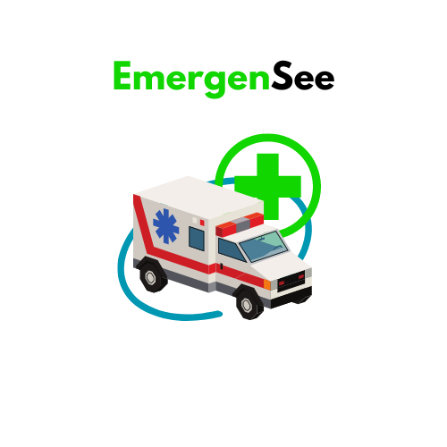

# EmergenSee

### This application aims to bridge the requirements of emergency service delivery to commnon people. With this simple app, people would be able to book an ambulance with just a single click.

## The uniqueness of this application lies in the idea that this application is a one stop for three types of users interacting with the apllication - customers,drivers and volunteers.
Volunteers and Police can register with this app to manage traffic conditions and also report any sudden circumstances to the driver.
---

Currently this app is in the prototype stage.

---

The application shall be designed on the following idea. The various screens that would work in the application are displayed.
This workflow of the application would be implemented using flutter front end and relies on the google maps api. The application logic also involves use of real time traffic
to be called to a backend api server.

